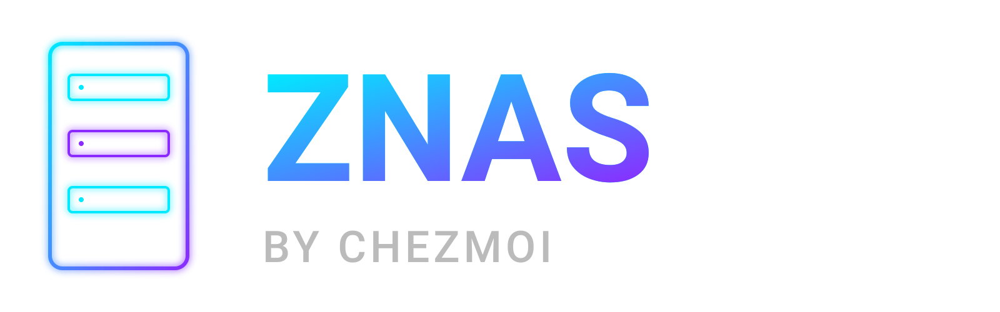

<p align="center">
  
</p>
<p align="center">
  <strong>Your ZFS storage, file shares, VMs and containers in one fast, beautiful portal.</strong><br/>
  Single binary. No database. No containers to babysit. Or boot it straight from a USB stick.
</p>
<p align="center">
  <a href="https://github.com/macgaver/zfsnas-chezmoi/releases/latest"></a>
  <a href="https://github.com/macgaver/znas-usb-appliance/releases/latest"></a>
  
  
  
</p>

<p align="center">
  <a href="https://youtu.be/usFcZ15AyOs?si=U-neyJLCjkAfNHMc">▶ Full end-to-end demo (v5)</a> &nbsp;·&nbsp;
  <a href="https://youtu.be/UjaSBK0vWkk">▶ Interlink &amp; new features (v6.3)</a>
</p>


---

## Why ZNAS?

Most NAS software is slow to install, slow to load, and buried under layers of
configuration. ZNAS is the opposite.

- **Up and running in minutes.** Flash a USB stick and boot, or run one command on
  Debian or Ubuntu, then create your admin account in the browser.
- **One binary, nothing else.** No Docker, no Node, no Python runtime, no database.
  The whole portal, UI included, is a single file that starts in under a second.
- **Storage, sharing and virtualization together.** ZFS pools, SMB/NFS/iSCSI shares,
  VMs, containers and Compose stacks, all managed from the same place.
- **Always current, never disruptive.** Updates are signed, applied in one click and take
  effect in seconds, like a modern browser. The previous version stays as a fallback.
- **Secure by design.** HTTPS only, roles with fine-grained permissions, two-factor
  login, an audit trail of every action, and optional sudo hardening.
- **Built for real homelabs.** Manage several servers from one window, back VMs up to
  another box, watch your UPS, and get alerts wherever you want them.

---

## Two ways to run it

### 🔌 The USB appliance: the easiest and most secure

**[⬇ Download the latest appliance image](https://github.com/macgaver/znas-usb-appliance/releases/latest)**

Flash it to a USB stick, boot your NAS from it, and open the address shown on the
screen. That's it.

- **Immutable OS.** Ubuntu 26.04 LTS runs read-only, loaded into RAM, so the system
  cannot drift or be tampered with.
- **Your settings live apart from the OS.** They sit on their own partition of the
  stick and survive every upgrade.
- **One-click platform upgrades.** New images are signed, then downloaded and verified
  by the portal itself. Stage the upgrade for later, or upgrade and reboot now.
- **Everything included.** Every feature (virtualization, iSCSI, UPS, disk power,
  MergerFS and more) is built in and ready. Nothing to install.
- **No OS disk needed.** All your drives stay free for your pools.

### 🐧 On your own Debian or Ubuntu server

Prefer a regular install? One command on Debian 13+ or Ubuntu 26.04+ sets up ZFS, a
service account, the portal and its systemd service. See [Installation](#installation).

---

## Features

### 🗄️ ZFS storage
- **Pools**: create Stripe, Mirror, RAIDZ1 or RAIDZ2 pools, import existing ones, expand them and upgrade their feature flags. Manage as many pools as you like side by side.
- **Datasets and ZVols**: a full nested hierarchy with quotas, reservations, record size, compression, sync, dedup and comments, plus block volumes for iSCSI and VMs.
- **Snapshots**: create, restore, clone and browse them per dataset, with scheduled hourly, daily, weekly or monthly policies and retention.
- **Native encryption**: AES-256-GCM pools and datasets, keys loaded automatically at boot, and key export compatible with TrueNAS.
- **Health and repair**: scheduled scrubs, cache devices (L2ARC/ZIL), ARC tuning, disk online/offline, and a **Pool Fixer** wizard that walks you through degraded or faulted pools.
- **MergerFS**: pool several datasets into one mountpoint, perfect for a media library spread across disks.

### 📁 File sharing
- **SMB**: Samba shares with per-user read/write or read-only access, home folders and global settings.
- **NFS**: exports with per-client networks and options.
- **iSCSI**: block shares backed by ZVols, with an initiator registry.
- **File browser**: browse any dataset or share in the portal and fix ownership and permissions, recursively if needed.

### 🖥️ Virtualization
- **VMs and LXC containers**, powered by Incus: create, start, stop, clone and snapshot them, with tags and groups to keep large setups tidy.
- **Consoles in the browser**: a terminal for every instance and a graphical console for VMs.
- **Compose stacks**: deploy Docker Compose applications to a container or VM in a few clicks, with scheduled auto-updates.
- **Hardware passthrough**: give a VM a GPU, HBA or any other PCI or USB device.
- **Networking**: bridges, managed networks and port forwarding for your instances.
- **Proxmox import**: bring your existing Proxmox VMs over, UEFI guests included.
- **Services**: publish the web apps you host and open them from the ZNAS menu, even embedded in the portal.
- **Memory compression** (zram) and swappiness tuning for denser hosts.

### 🛡️ Protection and backups
- **VM and container backups**: ZFS-native, incremental and fast, to a local pool or another ZNAS, with retention and one-click restore.
- **ZFS replication**: send datasets to another server on a schedule.
- **Filesystem sync**: copy data to or from external NFS, SMB and other shares with rsync.
- **UPS protection**: plug in a UPS and ZNAS detects and configures it, shows its battery in the top bar and shuts the server down safely according to your policy.

### 🌐 Many servers, one window
- **Interlink**: link your ZNAS servers and switch between them instantly from the same browser tab, with every page and terminal following along.
- **Push and pull** VMs, containers and data between linked servers.

### 📊 Monitoring and alerts
- **Live dashboard**: CPU, memory, network and disk I/O with 24-hour history.
- **Storage Map and Networking Layer**: interactive maps of your disks, pools, datasets, bridges and instances.
- **Capacity trends**: usage per pool or dataset over time, up to five years, with the usable-capacity limit drawn in.
- **Disk health**: SMART data, temperature and SSD wear-out for every drive, plus disk power management (spindown, APM, write cache).
- **Alerts everywhere**: Email, ntfy, Gotify, Pushover, Syslog and in-app notifications, each with its own choice of events. Pool and disk problems, scrub errors, unreachable servers and security updates are all covered.

### 🔐 Security and administration
- **HTTPS only**, with a certificate generated on first run, or import your own.
- **Users and roles**: admin, standard (with 11 granular permissions), read-only and SMB-only, plus control over active sessions.
- **Two-factor authentication** (TOTP) for any account.
- **Audit log** of every storage, sharing, login and system action.
- **Sudo hardening**: restrict the portal to exactly the commands it needs. See [SECURITY.md](SECURITY.md).
- **From the browser**: a web terminal, OS updates (one click or interactive), hostname, timezone and power management.
- **Looks great anywhere**: light and dark themes (including *Tron Legacy* and *Matrix Reload*), and a layout made for phones and tablets too.

---

## Installation

| Install type | Best for | How |
|---|---|---|
| **USB appliance** | A dedicated NAS: the simplest and most secure option | [Option A](#option-a--usb-appliance-recommended-for-a-dedicated-nas) |
| **Quick installer** | An existing Debian 13+ or Ubuntu 26.04+ server | [Option B](#option-b--quick-installer-on-debian-or-ubuntu) |
| **Proxmox VM** | Running ZNAS inside Proxmox, with disks passed through | [Wiki: Proxmox VM](https://github.com/macgaver/zfsnas-chezmoi/wiki/Installation-Proxmox-VM) |
| **Bare metal** | Installing Debian or Ubuntu yourself on NAS hardware | [Wiki: Hardware](https://github.com/macgaver/zfsnas-chezmoi/wiki/Installation-Hardware) |
| **Binary or source** | Development and custom builds | [Option C](#option-c--release-binary-or-build-from-source) |

### Option A — USB appliance (recommended for a dedicated NAS)

1. **Download** the latest `znas-usb-appliance-v….iso` from
   **[the appliance releases](https://github.com/macgaver/znas-usb-appliance/releases/latest)**.
   Each release also includes a `.sha256` checksum and a `.sig` signature.
2. **Flash** it to a USB stick (8 GB minimum; 32 GB or more on USB 3 or faster recommended)
   with [balenaEtcher](https://etcher.balena.io/),
   Rufus (in *dd mode*) or `dd`:
   ```bash
   sudo dd if=znas-usb-appliance-vX-Y-Z-N.iso of=/dev/sdX bs=4M conv=fsync status=progress
   ```
3. **Boot** the NAS from the stick and let the default *load OS to RAM* entry start.
   Keep the stick plugged in, because it holds your settings. The machine needs 4 GB of
   RAM or more (more is better with ZFS). UEFI with Secure Boot and legacy BIOS both work.
4. **Open** the address shown on the screen, `https://<nas-ip>:8443/setup`, and create
   your admin account.

Upgrades then appear in **Platform → USB Appliance Upgrades**. Want to build the image
yourself? See [usbimage/HOW-TO-BUILD-ISO.md](usbimage/HOW-TO-BUILD-ISO.md).

### Option B — Quick installer on Debian or Ubuntu

One command installs ZFS if needed, creates a dedicated service account, downloads the
latest release and registers a systemd service:

```bash
sudo bash -c "$(curl -fsSL https://raw.githubusercontent.com/macgaver/zfsnas-chezmoi/main/zfsnas-quickinstall-for-debian.sh)"
```

> Already root? Drop `sudo`. Avoid `sudo bash <(curl …)`: process substitution
> produces `/dev/fd/63: No such file or directory` under sudo.

Then open the URL it prints (`https://<server-ip>:8443/setup`) and create your admin account.

### Option C — Release binary or build from source

```bash
# Latest release (Linux amd64)
curl -Lo zfsnas https://github.com/macgaver/zfsnas-chezmoi/releases/latest/download/zfsnas-chezmoi
chmod +x zfsnas && ./zfsnas

# …or build it (Go 1.22+; the UI is embedded at compile time)
git clone https://github.com/macgaver/zfsnas-chezmoi.git
cd zfsnas-chezmoi && go build -o zfsnas . && ./zfsnas
```

Run it from a folder owned by a user with passwordless sudo (which you can restrict, see
[SECURITY.md](SECURITY.md)), then open `https://<server-ip>:8443/setup`.

### First steps in the portal

The first visit to `/setup` creates your administrator account. After you sign in,
the portal shows you anything still missing (system packages on a regular install, the
systemd service) and lets you import your existing ZFS pools or create new ones.

> Your browser will warn about the self-signed certificate on the first visit. It is
> generated on your server and only encrypts traffic between you and your NAS; you can
> import your own certificate later in Settings.

---

## Requirements

| | |
|---|---|
| **USB appliance** | An x86-64 machine with 4 GB of RAM or more, and a USB stick of 8 GB minimum (32 GB or more on USB 3 or faster recommended) |
| **Operating system** (other installs) | Debian 13 (Trixie) or later, or Ubuntu 26.04 LTS or later |
| **Privileges** | Passwordless `sudo` for the portal's service account (restrictable, see [SECURITY.md](SECURITY.md)) |
| **Building from source** | Go 1.22 or later |
| **Browser** | Any current browser, desktop or mobile |

---

## Under the hood

- **Go**: one statically linked binary with a millisecond cold start.
- **Embedded UI**: plain HTML, CSS and JavaScript compiled into the binary with `go:embed`. No npm, no bundler, no CDN calls.
- **JSON files instead of a database**: configuration that is easy to read, back up and move.
- **WebSockets**: live terminals, consoles, progress streams and metrics without polling.
- **Signed updates**: the portal verifies its own updates and appliance images against a key built into it before installing them.

---

## Security

The security model, sudo hardening, TLS and authentication are documented in
**[SECURITY.md](SECURITY.md)**.

## Important contributors
- Memeticsoup
- Exultantliving0

## License

GNU General Public License v3.0. See [LICENSE](LICENSE) for details.
